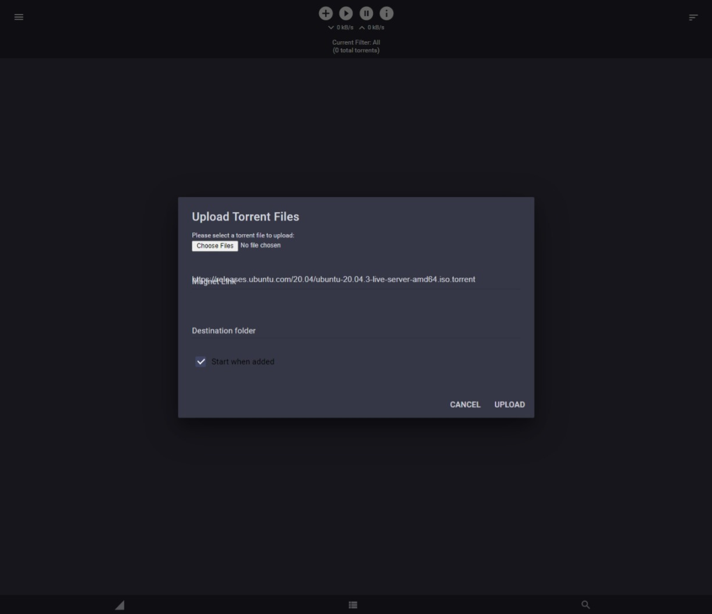
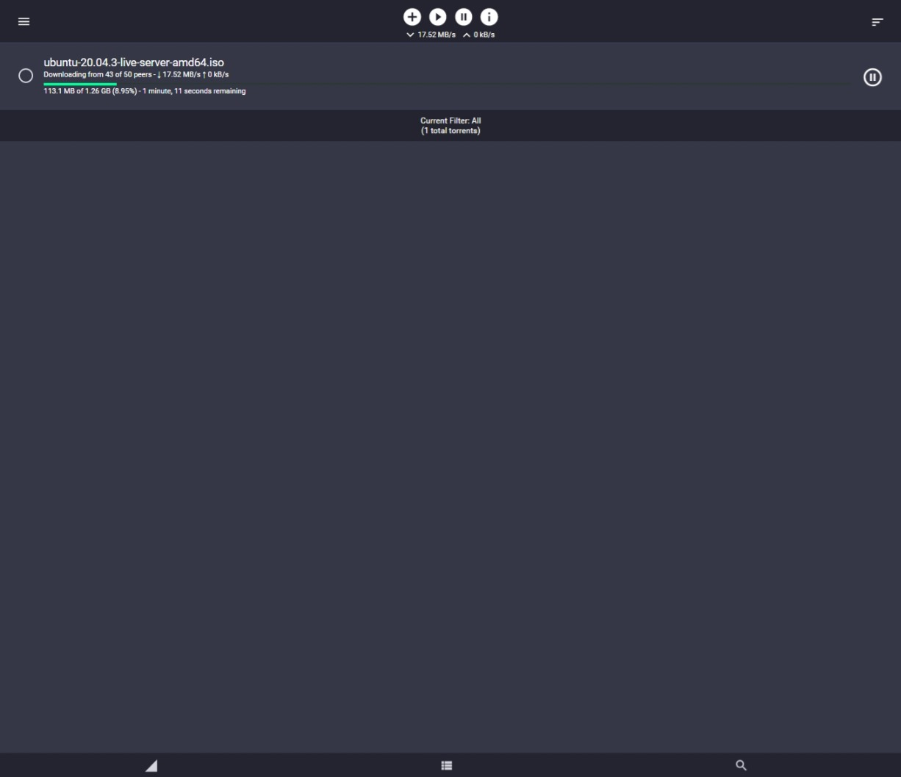
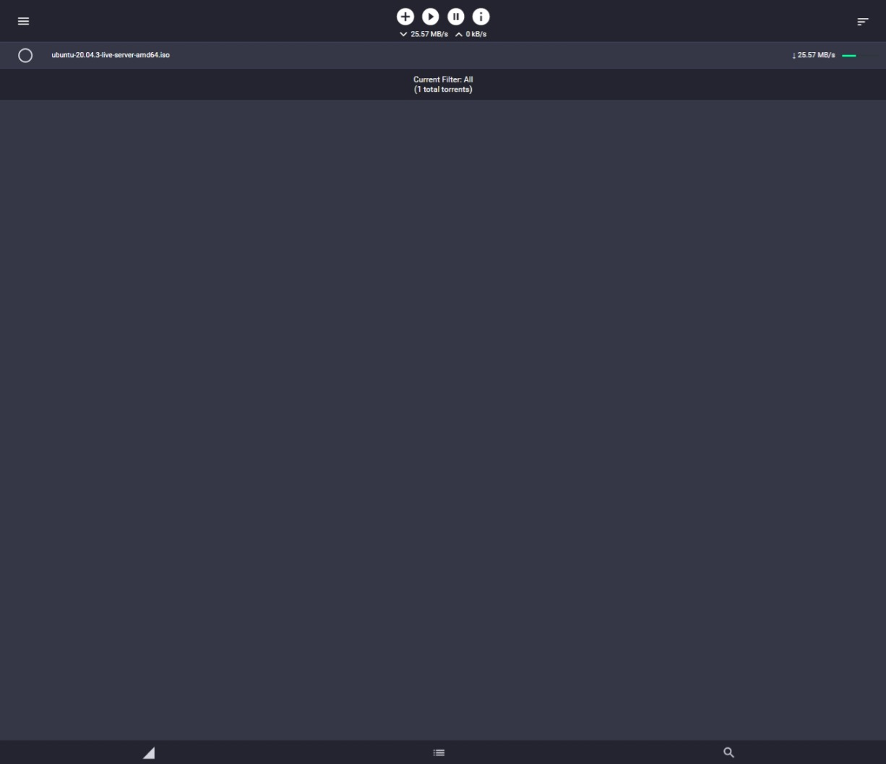
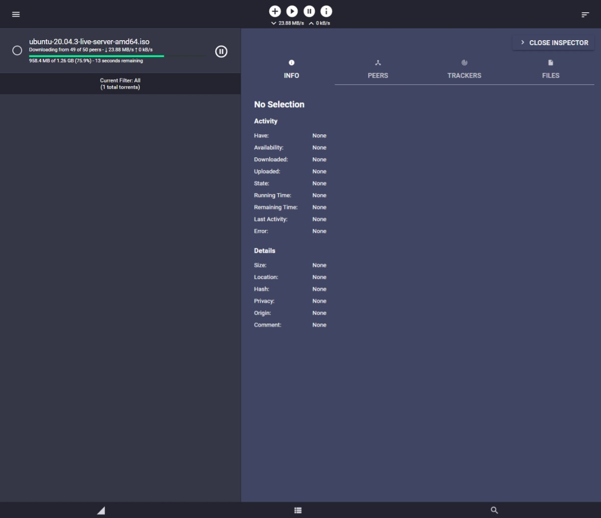
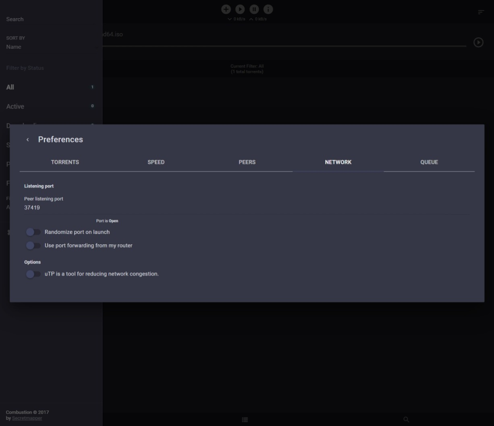

# [pyunramura/linuxserver-mods_transmission-dark](https://github.com/pyunramura/linuxserver-mods_transmission-dark)
**A linuxserver.io container-mod that applies a dark theme to the transmission combustion-ui**

 

This project's home is located at https://github.com/pyunramura/linuxserver-mods_transmission-dark

Find this image on the Github container registry at [ghcr.io/pyunramura/transmission-dark](https://github.com/pyunramura/linuxserver-mods_transmission-dark/pkgs/container/transmission-dark)

or in the Dockerhub registry at [pyunramura/transmission-dark](https://hub.docker.com/r/pyunramura/transmission-dark).

---

## Usage

This config mod is packaged for installation in linuxserver containers by defining:

`-e DOCKER_MODS=pyunramura/transmission-dark`  or

`-e DOCKER_MODS=ghcr.io/pyunramura/transmission-dark`

in the container's configuration.

## Constraints

This mod is compatible solely with the [**linuxserver/transmission**](https://fleet.linuxserver.io/image?name=linuxserver/transmission) image using `-e TRANSMISSION_WEB_HOME=/combustion-release/` as the transmission frontend.

## Mod Info

This mod contains a single css style created by user **SebDanielsson** at [**SebDanielsson/dark-combustion**](https://github.com/SebDanielsson/dark-combustion) which overwrites the default [combustion](https://github.com/Secretmapper/combustion) css file when applied. To revert this change, either remove the mod and recreate the container, or choose a different `TRANSMISSION_WEB_HOME` frontend.

## Screenshots

